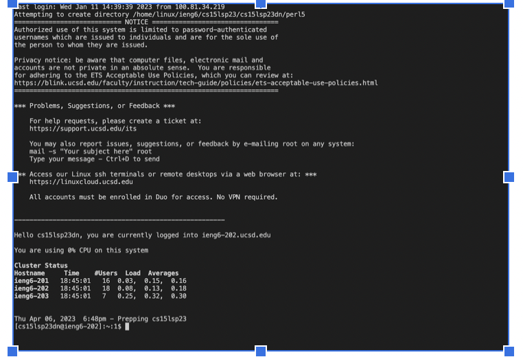

# cse15l-lab-reports
**1. Installing VScode**

Download and install the app, Visual Studio Code from this website [Link]([http://a.com](https://code.visualstudio.com/)). I skipped this process because I alreday had it installed.
It should be like this (example of mac):


**2. Remotely Connecting**
If you are using Windows, go to the website: [Link](https://gitforwindows.org/) to download and install the git. Follow the instruction on this link: [Link](https://stackoverflow.com/a/50527994) to set git bash as the default terminal in Visual Studio Code. I skipped this step because I use Mac

Then, to connect to ssh, open a new terminal in VScode (Ctrl or Command + `, or use the Terminal → New Terminal menu option). Then type ssh followed by a space and your course specific account. It should look like this: 
```
$ ssh cs15lwi23zz@ieng6.ucsd.edu
```
but with different account.

If you are new to this server, a image like this will show:
```
ssh cs15lwi23zz@ieng6.ucsd.edu
The authenticity of host 'ieng6.ucsd.edu (128.54.70.227)' can't be established.
RSA key fingerprint is SHA256:ksruYwhnYH+sySHnHAtLUHngrPEyZTDl/1x99wUQcec.
Are you sure you want to continue connecting (yes/no/[fingerprint])? 
```
Type ```yes``` in the terminal, and then input your password as instruction. It should be like this once you log in:

You are now connected to ssh and link to the computer in CSE basement.


**3.Trying Some Commands**
Run the commands ```cd```, ```ls```, ```pwd```, ```mkdir```, and ```cp``` a few times in different ways, both on your computer, and on the remote computer after ssh-ing (use the terminal in VScode) and see what they do. What commands will cause an error and why?

I tried ```ls /home/linux/ieng6/cs15lsp23/cs15lsp23nl ```, and I got an error message that looked like this:

where ```/home/linux/ieng6/cs15lsp23/cs15lsp23nl```is the account of another student in my group.
Ls supposed to list the files in the directory. The error message appeared because I don’t have the permission to access to other’s directory. 
